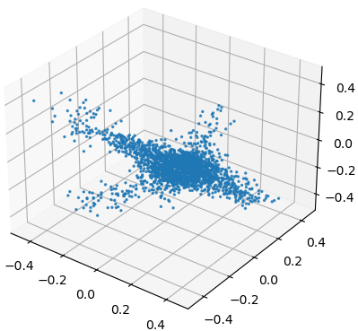
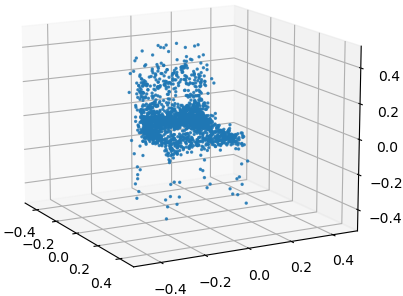

# Investigating PointNet++ for Point Cloud Generative Adversarial Networks

## Introduction
My final project for UMass Amherst graduate course CS 674: Intelligent Visual Computing. In this project, I developed and trained a Wasserstein Generative Adversarial Network with Gradient Penalty using Python and PyTorch. I trained models on point clouds sampled from the airplane and chair categories of the ShapeNetCore dataset. The trained models utilize neural networks to recognize the shape of a given class of 3D objects and generate original point clouds of that given class of objects. 

This project builds off of the work of [arXiv tech report](https://arxiv.org/abs/1707.02392).

Contains original code as well as code files from Learning Representations and Generative Models For 3D Point Clouds by <a href="http://web.stanford.edu/~optas/" target="_blank">Panos Achlioptas</a>, <a href="http://web.stanford.edu/~diamanti/" target="_blank">Olga Diamanti</a>, <a href="http://mitliagkas.github.io" target="_blank">Ioannis Mitliagkas</a>, <a href="http://geometry.stanford.edu/member/guibas/" target="_blank">Leonidas J. Guibas</a>.

## References

	@article{achlioptas2017latent_pc,
	  title={Learning Representations and Generative Models For 3D Point Clouds},
	  author={Achlioptas, Panos and Diamanti, Olga and Mitliagkas, Ioannis and Guibas, Leonidas J},
	  journal={arXiv preprint arXiv:1707.02392},
	  year={2017}
	}

References:
[1] Panos Achlioptas, Olga Diamanti, Ioannis Mitliagas, and Leonidas Guibas. Learning Representations and Generative Models for 3D Point Clouds. arXiv:1707.02392v3, 2017. 

[2] Balraj Ashwath. ModelNet10 – Princeton 3D Object Dataset. Kaggle.com. https://www.kaggle.com/datasets/balraj98/modelnet10-princeton-3d-object-dataset. (Accessed: May 6, 2022).

[3] Martin Arjovsky, Soumith Chintala, and Léon Bottou. Wasserstein GAN. arXiv:1701.07875v3, 2017.

[4] David Griffiths. Point cloud classification with PointNet. Keras.io. May 25, 2020. https://keras.io/examples/vision/pointnet/ (Accessed: May 6, 2022)

[5] Ishaan Gulrajani, Faruk Ahmed, Martin Arjovsky, Vincent Dumoulin, and Aaron Courville. Improved Training of Wasserstein GANs. arXiv:1704.00028v3, 2017.

[6] Charles R. Qi, Hao Su, Kaichun Mo, and Leonidas J. Guibas. PointNet: Deep Learning on Point Sets for 3D Classification and Segmentation. arXiv:1612.00593v2, 2017.

[7] Charles R. Qi, Li Yi, Hao Su, and Leonidas J. Guibas. PointNet++: Deep Heirarchical Feature Learning on Point Sets in a Metric Space. arXiv:1706.02413v1, 2017.

[8] Aadhithya Sankar. Demystified: Wasserstein GAN with Gradient Penalty (WGAN-GP). TowardsDataScience.com. October 22, 2021. https://towardsdatascience.com/demystified-wasserstein-gan-with-gradient-penalty-ba5e9b905ead. (Accessed: May 2, 2022)

[9] He Wang, Zetian Jiang, Li Yi, Kaichun Mo, Hao Su, and Leonidas J. Guibas. Rethinking Sampling in 3D Point Cloud Generative Adversarial Networks. arXiv:2006.07029v1, 2020.

         	

## Dependencies
Requirements:
- Python 3.8 with Numpy and Matplotlib
- PyTorch

## Installation
Instructions for Installing External Libraries and data
    
    i. Make sure Python 3.8 and Miniconda are installed
    
    ii. Run: conda install pytorch torchvision cudatoolkit -c pytorch
    
    iii. Manually install NVidia cuda toolkit from NVidia's website https://developer.nvidia.com/cuda-downloads
    
    iv. I had to externally install PointNet++ cuda kernel layers
        - I modified  the PointNet++ layers
        (PointCloudGAN/pointnet2_ops_lib/pointnet2_ops/pointnet2_modules.py) after installing to 
         remove batch normalization.
         To run code as is:
          a. Navigate terminal to pointnet2_ops_lib folder
          b. Run "python setup.py install" to install cuda kernels and dependencies
          c. Note that when running with Discriminator 2 (PointNet++), only cuda can be used, cpu doesn't work

    v. pip install trimesh (used for testing with ModelNet10)

Instructions for training:

    i. Go to https://www.dropbox.com/s/vmsdrae6x5xws1v/shape_net_core_uniform_samples_2048.zip?dl=0,
       Download, extract folder shape_net_core_uniform_samples_2048 and move to inside
        Matthew_Spahl_CS674FinalProject_Code/data

    ii. Open PointCloudGAN/src/point_cloud_wgan_gp_pytorch.py

    iii. For running with Discriminator 1 (PointNet-based), leave as is, run in PyCharm
         a. CSV created in plots folder
         b. Can change number of discrminiantor updates in line 324, but should be left as is
         c. If GPU at least as powerful as GTX 1060 6gb, leave batch as 50 on line 328, but it can be adjusted here
         d. To resume training, set should_continue to True and first_epoch to next epoch to train
         e. learning rate and betas can be modified on lines 254 and 255 (should be left as is)
         f. You may need to adjust the number of threads used to load data on line 237 - default is 4,
             may need to be changed to 1 depending on cpu threads.
         g. Run PointCloudGAN/src/point_cloud_wgan_gp_pytorch.py

    iv. For training with Discriminator 2 (PointNet++ single scale grouping) (note that results diverge, as expected):
         a. follow pointnet2_ops install instructions above
         b. comment out line 246, uncomment line 247 to change the discriminator used
         c. Make sure gpu is available
         d. set batch to size 10 on line 328
         e. adjust cpu threads as need be on line 237
         f. Run PointCloudGAN/src/point_cloud_wgan_gp_pytorch.py

    v. For attempting to train with Discriminator 2 with more generator updates (results diverge):
         a. Run reverse_wgan.py
         b. Make sure GPU available
         c. leave parameters as is, but batch size set on line 328, generator updates on line 324

Instructions for testing trained GAN generator:
    
    i. Run PointCloudGAN/src/demo_gan.py

    ii. Samples to generate an be modified on line 158

    iii. by default, generates samples using model trained with Discriminator 1, as those results are good,
         and Discriminator 2 cannot produce good results, but if you want to test results of Discriminator 2,
          can modify line 163 to use a different generator in the trained_models folder (not recommended)

Instructions for evaluating discriminator accuracy on ModelNet10 (accuracy values provided in report):
    
    i. Navigate to https://www.kaggle.com/datasets/balraj98/modelnet10-princeton-3d-object-dataset
       and download ModelNet10, extract, move to 
       /PointCloudGAN/data/modelnet10
 
    ii. run PointCloudGAN/src/test_discriminator.py, leave argument to
        train_gan_discriminator as "True" to sample from the models to build the point cloud
        data sets, which are stored in  /PointCloudGAN/data/modelnet10
        After running this once, can be changed to "False"
 
    iii. By default, trains on data for 60 epochs and then tests accuracy on ModelNet10 for Discriminator 1 
          (called MLP_Discriminator_Paper, based on implementation in [1]). Can be changed by commenting out 
          line 306, uncommenting line 305 to train and then test accuracy on Discriminator 2 (PointNet++ discriminator)

### Data Set
Data provided by Achlioptas et al.
Sampled from shape net core using uniform sampling.
https://github.com/optas/latent_3d_points

ModelNet10 dataset retrieved from 
https://www.kaggle.com/datasets/balraj98/modelnet10-princeton-3d-object-dataset

## License
This project is licensed under the terms of the MIT license (see LICENSE.md for details).
See references for credit for portions of code base.
